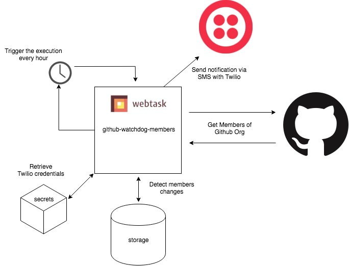

# github-watchdog-members

This is a simple hack periodically running on [webtask.io](https://webtask.io). It:

* gets the list of a specific organization members via GitHub API,
* detects changes between current members and previously stored ones,
* retrieves secret credentials for Twilio authentication,
* notifies an admin via SMS using Twilio.

## Diagram



## Live Demo

To manually run my hack execute:

```bash
$ curl https://wt-5268e879468a92063d597359415f9ee4-0.run.webtask.io/github-watchdog-members
{
  "members": {
    "total": 42,
    "names": [
      ......
    ]
  },
  "notification": "OK"
}
```

By default the hack retrieves members belonging to the organization `auth0`, to change it add a query string to the URL. 
For example `curl https://url?org=anotherorganization`.

### Configuration

[Scheduler by webtask.io](https://webtask.io/docs/cron) used to periodically execute the hack.

## License

**github-watchdog-members** is licensed under [MIT](LICENSE).
